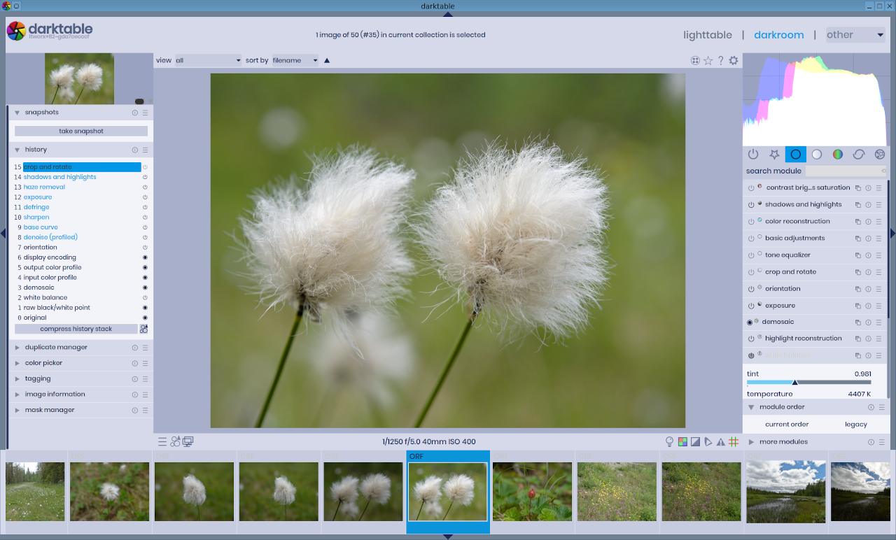

# Light Theme for Darktable 3.0

## Usage

1. Place **`themes`** and **`icons`** folders into Darktable's installation directory.
2. (Optional) Place fonts in in **`poppins-font`** folder to ``~/.fonts` directory.

## Screenshots

### Lightblue

### Light

